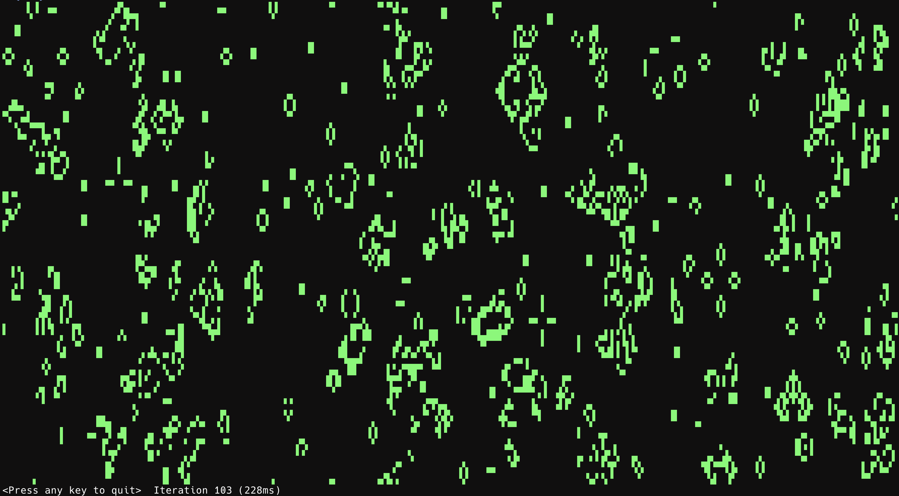

# Conway's Game of Life for the Terminal

## Overview

After reading the first part of [a blog post about Reddit interviews](https://alexgolec.dev/reddit-interview-problems-the-game-of-life/) by Alex Golec, I felt that creating my own iteration of [Conway's Game of Life](https://en.wikipedia.org/wiki/Conway%27s_Game_of_Life) in C# might be a fun practice exercise and a decent way to jump into newer versions of C# and .NET too. Other than verifying the rules of the game, I opted not to reference other implementations in order to see how well I could do.

The board is populated randomly at the start, and its borders wrap around such that cells that go beyond one border will appear on the opposite side. The simulation continues until there are no moves left or an infinite loop is reached.

## Usage

Requirements: .NET 8 Runtime or SDK

To run the application, just enter the GameOfLife.Console project folder run `dotnet run`. Use `dotnet run -- --help` for more information.

During the simulation, you can press the left and right arrows on your keyboard to adjust the speed.

### Performance

* Larger grids (i.e., those generated on larger or high-resolution screens) lead to slower speeds due to the sheer number of cells. The application is generally fast, but it's not optimized.

* The program runs much slower on Windows than on Mac OS and Linux. To my understanding, this is due to limitations of the Windows command line.

## 日本語の要約 (Japanese summary)

* Alex Golec氏が投稿された『[a blog post about Reddit interview strategy](https://alexgolec.dev/reddit-interview-problems-the-game-of-life/) (Redditの面接方法について)』というブログ記事の前半を読んでいたら、C#で[ライブゲーム](https://ja.wikipedia.org/wiki/%E3%83%A9%E3%82%A4%E3%83%95%E3%82%B2%E3%83%BC%E3%83%A0)を作ってみたいと思い、ゲームのルール以外は特に何も参照せずに僕なりに開発に挑んでみました。

* 当プログラムはCLIのプロジェクトで、せっかくなのでC#の割と新しい機能も試用しています。
